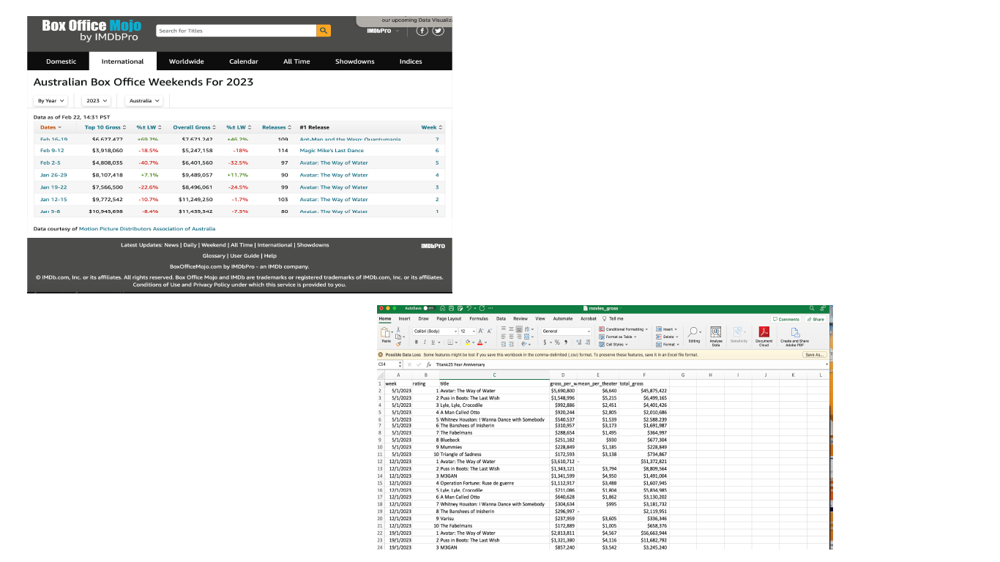
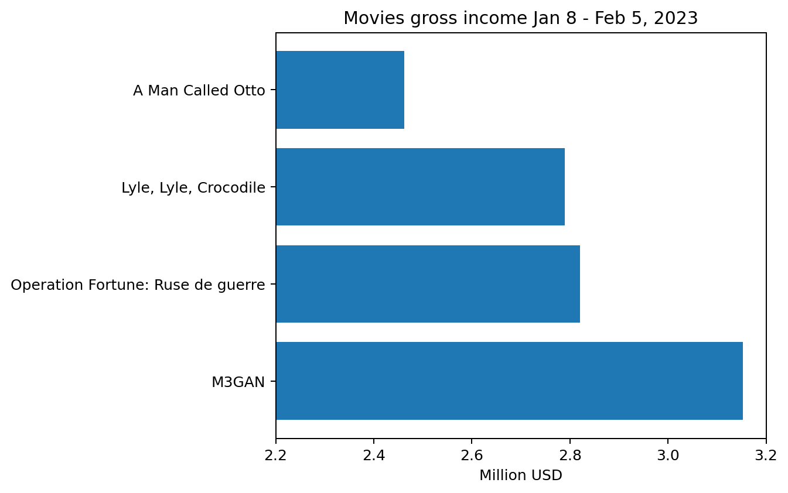
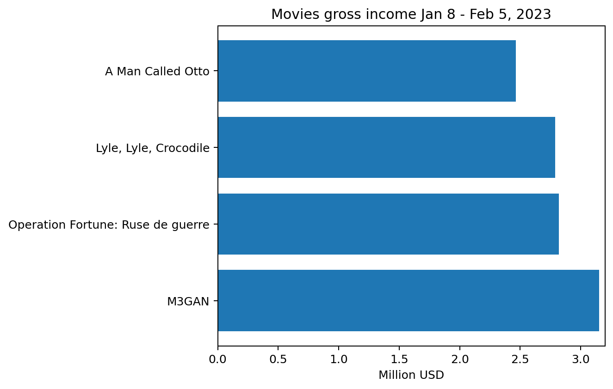
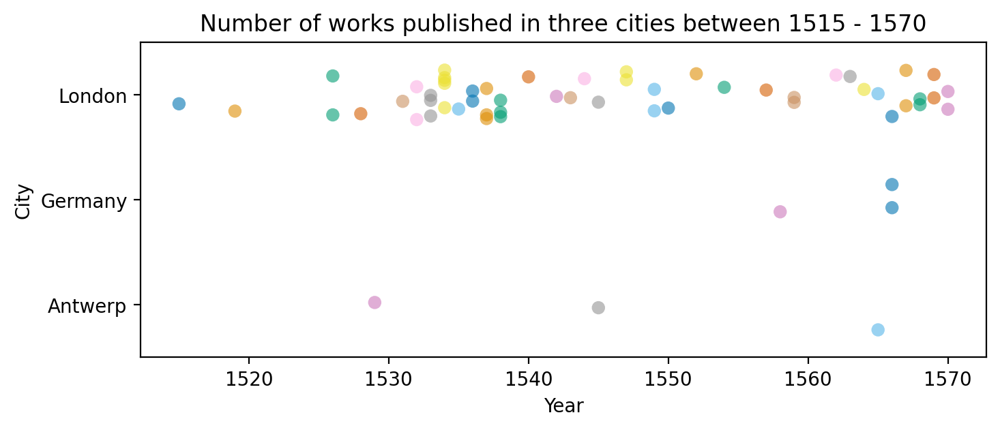
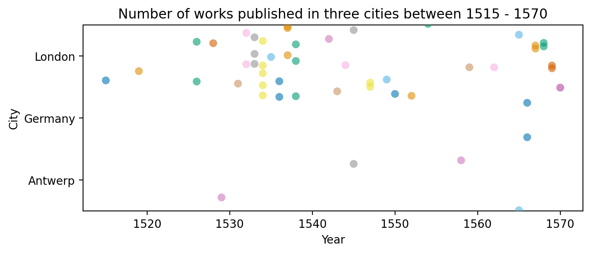
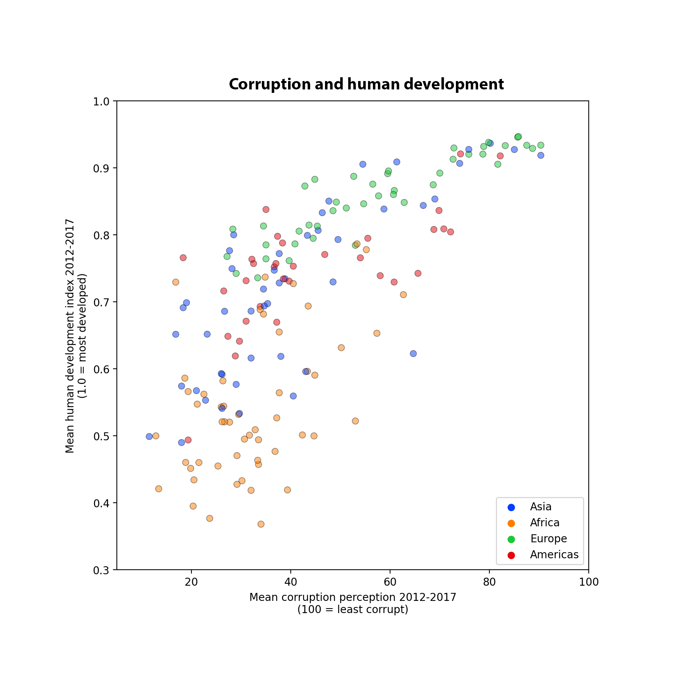
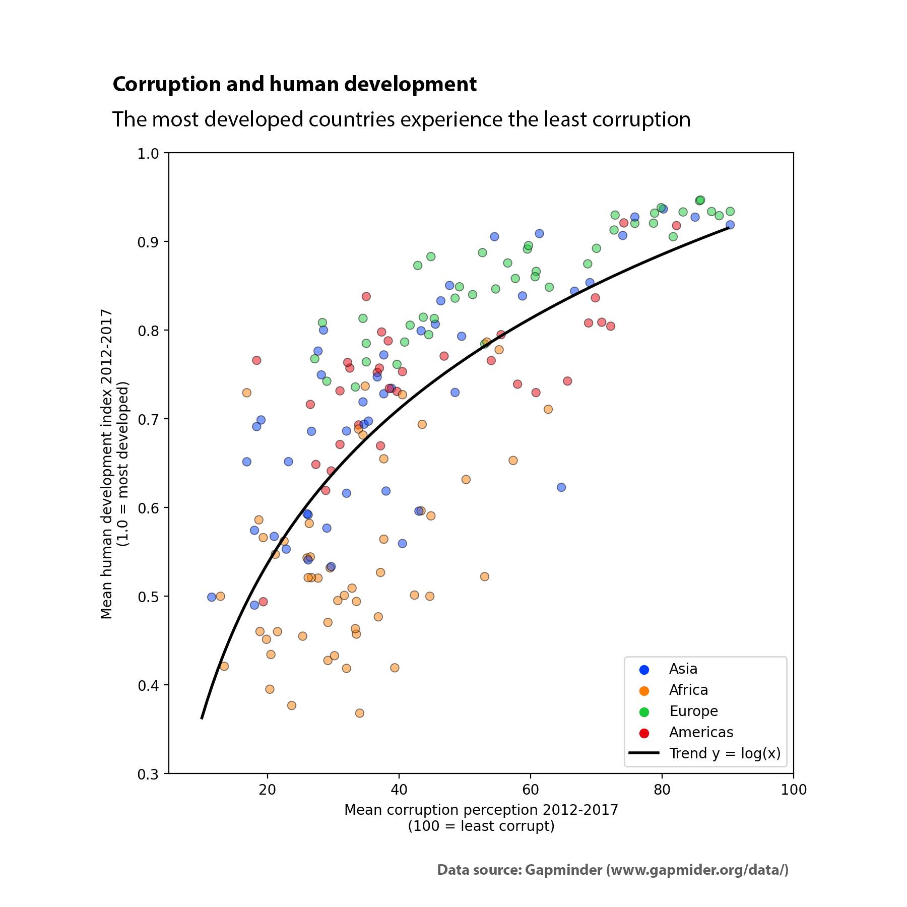
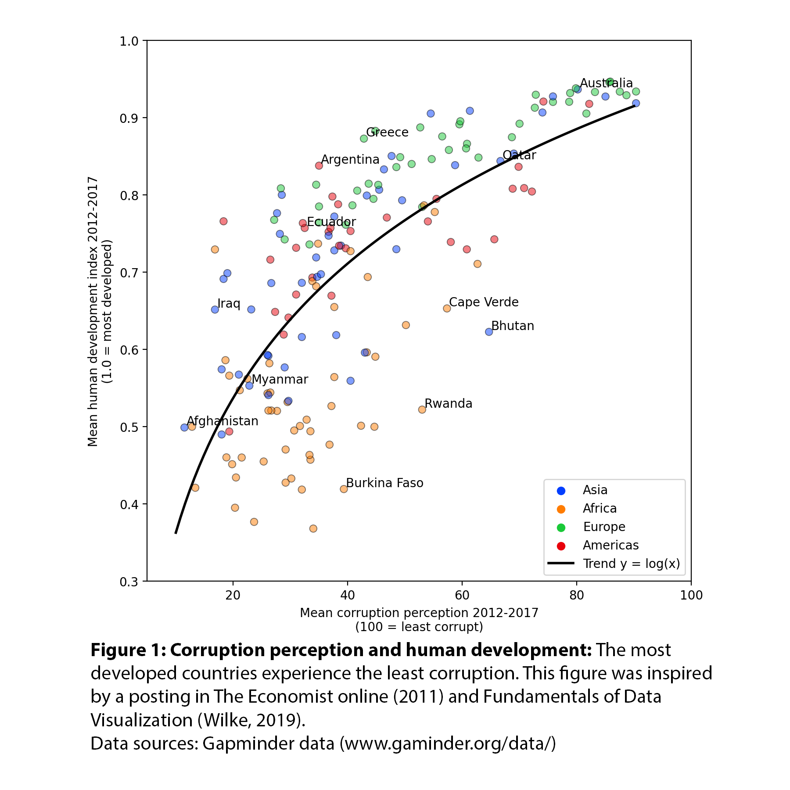
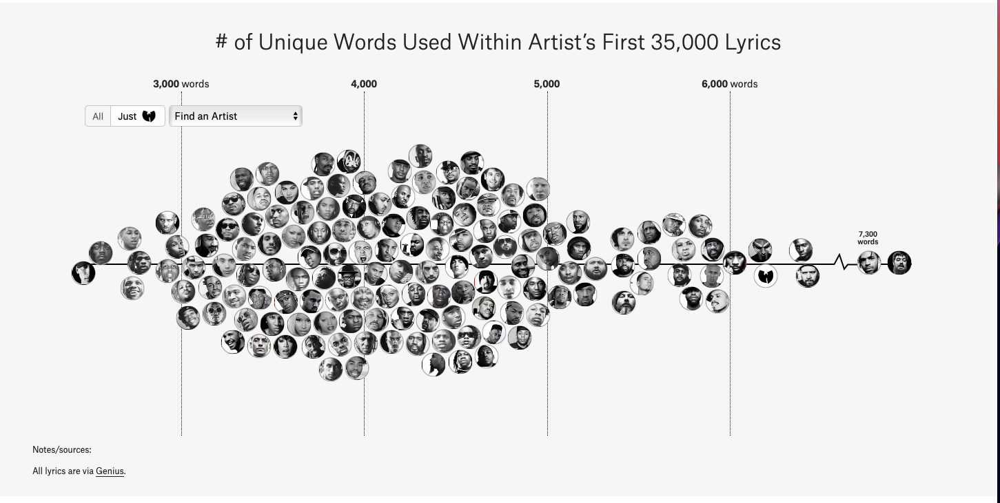

# 1. Data visualisation basics 
## What is data? (Participative activity adapted from ['Future Proof and FAIR Research Data: Open Data Management Best Practices and First Steps'](https://www.fosteropenscience.eu/node/2603))(45 mins)

* Form groups (can be randomly allocated using a survey tool) and discuss:
 - In your discipline, what are research data?
 - How do they look like?  
 - How can you interpret them?
 - Share results and discuss as a group
* Humanities, Arts and Social Sciences (HASS) research produces and work with data  
* These can take many forms (i.e. discussion outcomes)
* HASS research involves **enrichment** of data where layers of interpretation are added to original content: the value of annotations.
* Need to identify original (primary) and secondary data i.e. text anotation on work or corpora.

## The importance of visual representation
* Visual representation is the key activity of data visualisation
* Visuals help researcher to communicate results and/or research journey.
* Comprenhension of results and rationale by broader public. From knowledge to comprenhension.

## Informing Vs communicating: From perception to comprenhension
* Perception, interpretation, comprenhension

| Perceiving                                |Interpreting                                         |Comprenhending        |
|-------------------------------------------|-----------------------------------------------------|----------------------|
|Visualisation being used                   |Interesting features, shapes, patterns or connections|What has been learnt? |
|Items represented by marks                 |Expected/unexpected features                         |What feelings have been stirred?                  |
|Range of displayed values                  |Relevant features given the subject                  |What can be done with new knowledge                  |
|Are data and representation *trustworthy*? |                                                     |                  | 

### Perception to comprenhension: A visual journey

Some real data to begin our discussion

[The Box Office Mojo by IMDPro](https://www.boxofficemojo.com/weekend/2023W01/?area=AU&ref_=bo_wey_table_7) an open dabase of movie releases and box office revenue.

* What features are observable?
* Where are the largest, mid-sized and smallest values?
* Where are the most and the last?
* Where is the _average_?

* Are more features perceivable?

* What features are interesting?
* What features are unexpected?
* What features are important given the context?

* What has been learnt?
* Has the experience had an impact emotionally?
* What does one do with this information?

 ## Visual encoding: marks and attributes
 * Marks represent items of data (lines, points, shapes) *not* their value
 * Attributes visual variations of marks (colour, size, position) that describe the *value* associated with a particular marker.

## The design process 
* There is no perfect visualisation, but many ways to do the same task.

### Principle of proportional ink
 **Attributes must be proportional to the data values represented.**
    
     Problems with this figure?
    
    

### Overlapping points
* Arises when data has low resolution: the scale used to measure our data is too large so individual observations are hard to tell appart from each other.
* Data points will have the same value even if they represent different entities or events.

**The data**
The Early English Books Online database ((EEBO)[https://www.proquest.com/eebo]) contains digital samples of almost every work printed in English from 1470 to 1700.

* Problems with this visualisation?

A first solution: Displacing each point randomly by a little amount so that individual points become visible or _jitter_

Careful! too much jitter can also affect the integrity of the visualisation. 

### Context to facilitate comprehension

* Each visualisation requires different solutions to work, but there are some minimum requirements to improve communication with audience

**The data**
[A report published in 2011 by The Economist](https://www.economist.com/graphic-detail/2011/12/02/corrosive-corruption) revealed a correlation between corruption and development based on Transparency Interantional Corruption Perception Index and the UN's Human Development Index (HDI). Here we updated this report using data from 2012 to 2017 compiled by [Gapminder](https://www.gapminder.org/data/).

## Legends and axis labels
* Every figure needs a title conveying to the reader what the visualisation is about.
* Legend help readers to identify marks and attributes easily. 
* Axis labels give to reader a sense of time (days, months, years, centuries), magnitude (hundrends, thousands, millions), unit (for physical attributes), or orientation (North, South, East, West).

## Context and annotations
* Help reader going from perception to comprenhension.
* Make comparisons possible and the identification of extreme cases
* Put data into a broader context

## Captions and placement of titles
* Where is the visualisation going to be presented: print Vs. display

# 2.GALLERY OF VISUALISATIONS
 ## CHRTS: the principal families of chart types for visualising quantitative data
   - Categorical plots: Compare categories and distributions by *quantification* of data
     - Bars, Word clouds, Pictograms
   
   
   
   
   
   
   
   - Hierarchical plots: Reveal part-to-whole (part of a whole) relationships
     - Pie/Donut charts, Tree maps
   - Relational plots: Display correlations and connections
   - Temporal plots: Trends and intervals over time
   - Spatial: Maps spatial patterns through overlays.

 **[From data to viz](https://www.data-to-viz.com)**
 
   - Bars
   - Scatter plots
   - Maps
   - Network diagrams

 
 
 # 3. Interactive and animated visualisations
 Interactive visualisations: From viewer to user. 
|Pros                                                               |Cons                                                            |
|-------------------------------------------------------------------|----------------------------------------------------------------|
|Can expand physical limits of a visualisation                      |Viewer must be enticed to become a user                         |
|May provide different insights to different people                 |Can only be fully realised on digital media                     |
|Facilitates changing perspectives to show different aspects of data|Limited technological resources may impair visual communication |
|Amplifies control over the viewing experience                      |Accesibility may be affected                                    |

Features:
* Filtering: User controls the data to be displayed by including or excluding certain categorial groups or values
* Highlighting: Emphasises particular aspects of the data by highlighting specific values. Summarises values
* Participating: Ask users to input data to produce a display quizzes and surveys.
* Navigating: Accessing multiple views or gaining a more detailed display by zooming in.
* Animation: Can give an spatial or temporal dimension to data.

Features are not mutually exclusive and can be mixed to facilitate comprenhension.

Examples:
[Baby Names in England and Wales](https://www.ons.gov.uk/visualisations/dvc363/babyindex.htm)
[COVID-19 visualizer](https://www.covidvisualizer.com)
[Colonial Frontier Massacres Australia map](https://c21ch.newcastle.edu.au/colonialmassacres/map.php)

 ## What is the best plot for my data?
 
 # 3. Colour theory and digital colour palettes
 
 Color theory is the study of how colors interact with one another and how they can be combined to create aesthetically pleasing designs. It explores the science and psychology behind colors and how they can be used to create visual impact and meaning.

Color theory is based on the color wheel, which is a circular diagram that shows the primary, secondary, and tertiary colors. The primary colors are red, blue, and yellow, and they cannot be created by mixing other colors. Secondary colors are created by mixing two primary colors together, such as purple (red and blue) and green (blue and yellow). Tertiary colors are created by mixing a primary color with a secondary color, such as red-orange or blue-green.

One important aspect of color theory is color harmony, which refers to the way colors are combined to create a pleasing visual effect. There are several ways to achieve color harmony, including complementary colors, analogous colors, and triadic colors. Complementary colors are opposite each other on the color wheel, such as red and green, and they create a strong visual contrast when used together. Analogous colors are next to each other on the color wheel, such as blue and green, and they create a harmonious and calming effect. Triadic colors are evenly spaced on the color wheel, such as red, yellow, and blue, and they create a vibrant and balanced color scheme.

Another aspect of color theory is color psychology, which explores the emotional and psychological effects of colors. For example, red is often associated with passion and energy, while blue is associated with calmness and trust. Different colors can evoke different emotions and moods, and designers can use this knowledge to create designs that convey a particular message or feeling.
 
 
 Psychology of Colour
 
The psychology of color explores how different colors can affect our emotions, moods, and behaviors. While color psychology is not an exact science and can vary based on cultural contexts and personal experiences, there are some general associations and meanings that can be applied to colors.

Red is often associated with passion, excitement, and danger. In Western cultures, red is often associated with love and Valentine's Day. In China, red is considered a lucky color and is associated with prosperity and happiness. In India, red is often worn by brides and is seen as a symbol of purity and fertility.

Yellow is associated with happiness, optimism, and warmth. In Western cultures, yellow is often associated with sunshine and summer. In Japan, yellow is considered a sacred and imperial color. In Egypt, yellow is associated with mourning.

Blue is associated with calmness, trust, and serenity. In Western cultures, blue is often associated with the ocean and the sky. In China, blue is associated with immortality and longevity. In Iran, blue is associated with mourning and depression.

Green is associated with nature, growth, and balance. In Western cultures, green is often associated with environmentalism and sustainability. In Islamic cultures, green is considered a sacred color and is associated with paradise.

Purple is associated with royalty, luxury, and creativity. In Western cultures, purple is often associated with nobility and wealth. In Thailand, purple is considered a mourning color.

White is associated with purity, cleanliness, and innocence. In Western cultures, white is often associated with weddings and new beginnings. In China, white is associated with death and mourning.

Black is associated with sophistication, elegance, and mystery. In Western cultures, black is often associated with formal events and mourning. In Japan, black is considered a color of honor and respect.

While these are just some general associations and meanings of colors, it's important to remember that color psychology can vary based on cultural contexts and personal experiences. Designers should consider the cultural nuances of color meanings when creating designs for a specific audience or market. By understanding the psychology of color and its cultural nuances, designers can create effective and meaningful designs that resonate with their audience.
 
 
 
 ## Human colour vision and the computer red, green and blue (RGB) system: properties of colour and how they are represented
   - Colour names, RGB and hex notation to define colours
 ## Colour blindness and design principles for inclusive visualisations
 ## Choosing colour palettes to facilitate visual encoding
   - Qualitative, sequential and diverging colour palettes
 
 # 4. Common visualisation pitfalls
 ## Colour use
 ## Unnecessary use of 3-D
 ## Understanding your audience
 
 # 5. Tools for making visualisations
 ## Coding Vs. no-coding solutions
 ## Tools with buttons, menus and a graphical user interface: Excel, Kepler, Gephi
 ## Python or R: Choosing the right tool for the job
