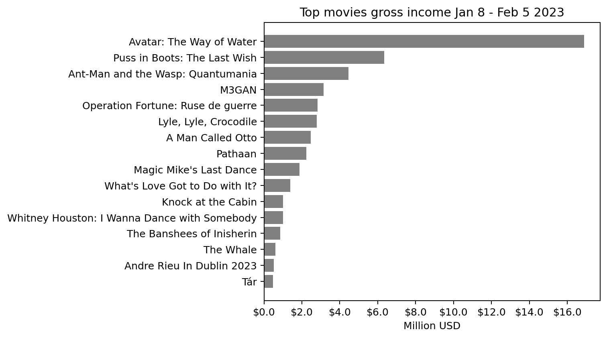
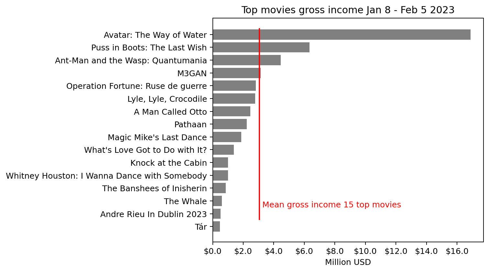
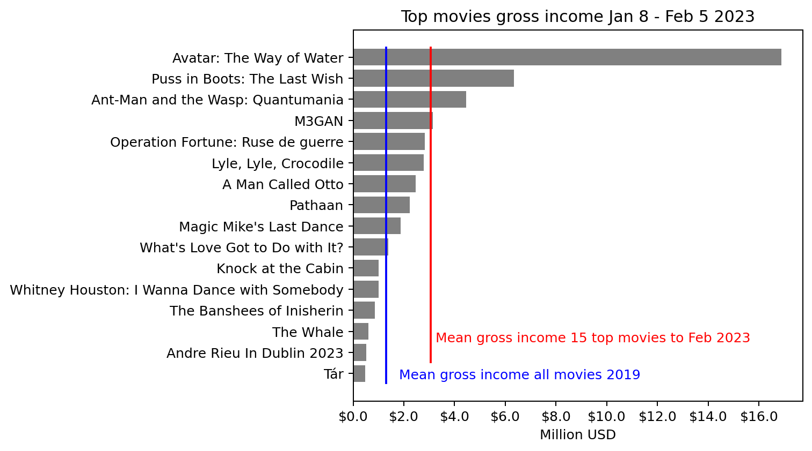

# 1. Data visualisation basics 
## What is data? (Participative activity adapted from ['Future Proof and FAIR Research Data: Open Data Management Best Practices and First Steps'](https://www.fosteropenscience.eu/node/2603))(45 mins)

* Form groups (can be randomly allocated using a survey tool) and discuss:
 - In your discipline, what are research data?
 - How do they look like?  
 - How can you interpret them?
 - Share results and discuss as a group
* Humanities, Arts and Social Sciences (HASS) research produces and work with data  
* These can take many forms (i.e. discussion outcomes)
* HASS research involves **enrichment** of data where layers of interpretation are added to original content: the value of annotations.
* Need to identify original (primary) and secondary data i.e. text anotation on work or corpora.

## The importance of visual representation
* Visual representation is the key activity of data visualisation
* Visuals help researcher to communicate results and/or research journey.
* Comprenhension of results and rationale by broader public. From knowledge to comprenhension.

## Informing Vs communicating: From perception to comprenhension
* Perception, interpretation, comprenhension

| Perceiving                                |Interpreting                                         |Comprenhending        |
|-------------------------------------------|-----------------------------------------------------|----------------------|
|Visualisation being used                   |Interesting features, shapes, patterns or connections|What has been learnt? |
|Items represented by marks                 |Expected/unexpected features                         |What feelings have been stirred?                  |
|Range of displayed values                  |Relevant features given the subject                  |What can be done with new knowledge                  |
|Are data and representation *trustworthy*? |                                                     |                  | 

### Perception to comprenhension: A visual journey

Some real data to begin our discussion

[The Box Office Mojo by IMDPro](https://www.boxofficemojo.com/weekend/2023W01/?area=AU&ref_=bo_wey_table_7) an open dabase of movie releases and box office revenue.

* What features are observable?
* Where are the largest, mid-sized and smallest values?
* Where are the most and the last?
* Where is the _average_?

* Are more features perceivable?

* What features are interesting?
* What features are unexpected?
* What features are important given the context?

* What has been learnt?
* Has the experience had an impact emotionally?
* What does one do with this information?

## The design process 

* There is no perfect visualisation, but many ways to do the same task.

   - Principle of proportional ink 
   - Overlapping points
   - Legends and labels
   - Context and annotations
 ## Visual encoding: marks and attributes
 * Marks represent items of data (lines, points, shapes) *not* their value
 * Attributes visual variations of marks (colour, size, position) that describe the *value* associated with a particular marker.
 ## The grammar of graphics
 
 # 2. Data types and a directory of visualisations
 
 ## Static, interactive and animated visualisations
 ## Structured and unstructured data types (text, numbers, images)
 ## CHRTS: the principal families of chart types for visualising quantitative data
   - Categorical
   - Hierarchical
   - Relational
   - Temporal
   - Spatial

 ## Gallery of visualisations
   - Bars
   - Scatter plots
   - Maps
   - Network diagrams
 
 ## What is the best plot for my data?
 
 # 3. Colour theory and digital colour palettes
 ## Human colour vision and the computer red, green and blue (RGB) system: properties of colour and how they are represented
   - Colour names, RGB and hex notation to define colours
 ## Colour blindness and design principles for inclusive visualisations
 ## Choosing colour palettes to facilitate visual encoding
   - Qualitative, sequential and diverging colour palettes
 
 # 4. Common visualisation pitfalls
 ## Colour use
 ## Unnecessary use of 3-D
 ## Understanding your audience
 
 # 5. Tools for making visualisations
 ## Coding Vs. no-coding solutions
 ## Tools with buttons, menus and a graphical user interface: Excel, Kepler, Gephi
 ## Python or R: Choosing the right tool for the job
